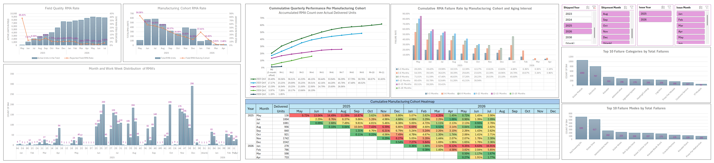

# Product Reliability and RMA Analytics

## 1. Project Overview

Analyzed field quality RMA data to assess product reliability, compare manufacturing cohort performance, identify failure trends, and monitor product performance throughout its lifecycle.

**Tools:** Excel, Power Query, Pivot Tables, Excel Formulas

---

## 2. Dashboard Overview

  

---

## 3. Questions

  
- What is the overall Return Material Authorization (RMA) rate in the field?
- Which manufacturing cohorts (based on production period) have the highest and lowest RMA rates?
- When do RMAs occur most frequently by month and work week?
- How does the cumulative RMA rate change as each quarterly manufacturing cohort ages?
- Which manufacturing cohorts and time periods exhibit the highest cumulative RMA rates?
- How do cumulative RMA rates vary across aging intervals for each manufacturing cohort?
- Which product categories contribute the most failures?
- What are the most common failure modes reported by customers?

---

## 4. Data Preparation

| **Step** | **Description** |
|-----------|-----------------|
| **Data Sources** | Combined two Field Quality RMA and manufacturing data sources into a single dataset using **Power Query**. |
| **Data Cleaning** | Used **Power Query** and **Excel formulas** to remove duplicates, correct data types, handle missing values, and clean and standardize text fields. |
| **Text Extraction** | Extracted serial numbers and other relevant information from semi-structured notes using **Power Query** and **Excel formulas**. |
| **Data Standardization** | Developed custom **Spelling Correction** and **Failure Mapping** tables to correct spelling variations, standardize inconsistent issue descriptions, and classify failures into standardized failure modes, categories, and failure types. |
| **Data Integration** | Merged and matched multiple datasets using **Power Query** to create a unified, analysis-ready dataset. |
| **Output** | Produced a clean, consistent, and structured dataset to support RMA trend analysis and interactive dashboard reporting. |

---

## 5. Data Validation

  
**Objective:** Verify that the total number of RMA records in the dashboard matches the cleaned dataset.

**Validation:** Compared the total RMA count from the cleaned Power Query output with the Pivot Table summary and dashboard KPI.

**Result:** All totals matched, confirming that no records were lost or duplicated during data preparation.

**Steps:**

1. Apply dashboard filters.
2. Verify dashboard result (**38 RMAs**).
3. Apply the same filters to the source dataset.
4. Confirm source record count = **38**.

  

---

## 6. Dashboard & Analysis

| Chart | Question | Focus |
|---|---|------|
| **Field Quality RMA Rate** | What is the overall Return Material Authorization (RMA) rate in the field? | Overall field quality performance. |
| **Manufacturing Cohort RMA Rate** | Which manufacturing cohorts (based on production period) have the highest and lowest RMA rates? | Compare product quality across manufacturing periods. |
| **Month and Work Week Distribution of RMA's** | When do RMAs occur most frequently by month and work week? | Identify temporal patterns and recurring peaks in RMAs. |
| **Cumulative Quarterly Performance Per Manufacturing Cohort (Accumulated RMA Count over Actual Delivered Units)** | How does each manufacturing cohort's cumulative RMA rate change over successive quarters? | Emphasizes the trend over time for each quarterly cohort. |
| **Cumulative Manufacturing Cohort Heatmap** | Which manufacturing cohorts and time periods exhibit the highest cumulative RMA rates? | Quickly identify high-risk manufacturing periods. |
| **Cumulative RMA Failure Rate by Manufacturing Cohort and Aging Interval** | How do failure rates evolve as products age for each manufacturing cohort? | Emphasizes which aging intervals contribute the most to cumulative failures. |
| **Top 10 Failure Categories by Total Failures** | Which product categories contribute the most failures? | Highlights the modules or systems (e.g., Kneader, Press, Vertical Tray, Connectivity) responsible for the largest share of RMAs, helping prioritize reliability improvement efforts and engineering resources. |
| **Top 10 Failure Modes by Total Failures** | What are the most common failure modes reported by customers? | Identifies the specific defects causing the highest number of failures, enabling targeted root cause investigations, corrective actions, and design improvements. |

---

## 7. Key Findings

| Question | Dashboard Visual | Conclusion |
|----------|------------------|------------|
| **What is the overall Return Material Authorization (RMA) rate in the field?** |  | The reported field RMA rate stabilized at approximately **1–3%** while active units in the field (cumulative deliveries minus previous RMAs) continued to increase, indicating improved product reliability as the installed base grew. |
| **Which manufacturing cohorts (based on production period) have the highest and lowest RMA rates?** |  | Manufacturing cohort RMA rates generally decreased across newer shipment cohorts, with a temporary increase in **January 2026**. RMA rates from **March 2026 onward** may be understated due to limited Customer Support (CS) operations, which reduced RMA reporting. |
| **When do RMAs occur most frequently by month and work week?** |  | RMAs occurred most frequently between **June and December 2025**, with the highest volume recorded during **Work Week 51**, indicating that failures were concentrated in the latter half of 2025. |
| **How does the cumulative RMA rate change as each quarterly manufacturing cohort ages?** |  | The cumulative RMA rate increased as each quarterly manufacturing cohort aged, although the rate of increase gradually slowed over time, indicating that failures accumulated as products remained longer in the field. |
| **Which manufacturing cohorts and time periods exhibit the highest cumulative RMA rates?** |  | The **May and June 2025** manufacturing cohorts exhibited the highest cumulative RMA rates, reaching approximately **15% by July 2026**. In general, cumulative RMA rates increased with field age, with older cohorts consistently showing higher values than newer cohorts. |
| **How do cumulative RMA rates vary across aging intervals for each manufacturing cohort?** |  | Cumulative RMA rates increased across successive aging intervals for all manufacturing cohorts. The highest cumulative failure rates were generally observed after **9–15 months** in the field, indicating that failures continued to accumulate as products aged. |
| **Which product categories contribute the most failures?** |  | The **Kicker Module** contributed the largest number of failures, followed by **Electrical** and **Kneader** issues. These categories accounted for most RMAs, making them the highest-priority areas for product reliability improvement. |
| **What are the most common failure modes reported by customers?** |  | **Not Powering On** and **Kicker Drive** were the most common failure modes, significantly exceeding all others. Prioritizing improvements in these failure modes would have the greatest impact on reducing overall RMA cases. |

---

## Interactive Analysis

### January 2026 Cohort RMA Increase

**Dashboard Visual**

  

**Key Finding**

Cross-filtering revealed that the increase in cumulative RMA rates for the **January 2026** manufacturing cohort began in **April 2026**, coinciding with a sharp increase in **Kicker Module** failures. Prior to April 2026, no Kicker Drive RMAs were recorded for this cohort, suggesting that this failure mode was the primary contributor to the observed increase in cumulative RMA rates.

---

### Work Week 51 RMA Spike

**Dashboard Visual**

  

**Key Finding**

The highest RMA volume occurred during **Work Week 51**. Interactive filtering showed that **Flour Tunnel Block** was the dominant failure mode for the earliest manufacturing cohorts during this period. However, this failure mode was not consistently observed in later cohorts, suggesting that it was a **cohort-specific issue** rather than a persistent product reliability trend.

---

## 8. Recommendations

| Recommendation | Rationale |
|---------------|-----------|
| **Improve failure mode data quality by ensuring all RMAs are assigned accurate failure modes instead of administrative notes.** | A growing number of administrative records reduces the accuracy of failure trend analysis and root cause identification. |
| **Prioritize corrective actions for Kicker Module, Electrical, and Kneader-related issues.** | These categories account for the highest number of reported failures and present the greatest opportunity to reduce overall RMAs. |
| **Investigate the emergence of Kicker Module failures in the January 2026 manufacturing cohort.** | Interactive analysis identified the Kicker Module as the primary contributor to the increase in cumulative RMA rates beginning in April 2026. |
| **Review the root cause of Flour Tunnel Block failures in the earliest manufacturing cohorts.** | Although not consistently observed in later cohorts, this failure mode was the primary contributor to the Work Week 51 RMA spike. |
| **Continue monitoring cumulative RMA rates by manufacturing cohort.** | Cohort analysis enables early detection of reliability issues and helps measure the effectiveness of manufacturing improvements over time. |
| **Validate lower RMA rates from March 2026 onward against Customer Support reporting capacity.** | Reduced Customer Support (CS) operations may have resulted in underreported RMAs, affecting the interpretation of reliability trends. |

---

## 9. Skills Demonstrated

| Skill Area | Tools / Techniques |
|------------|--------------------|
| **Data Cleaning** | Power Query, Excel Formulas |
| **Data Transformation** | Power Query M, Custom Transformations, Text Extraction |
| **Data Integration** | Merge Queries, Lookup Table Matching, Query Joins |
| **Data Standardization** | Failure Mapping, Spelling Correction, Data Mapping |
| **Data Validation** | Source-to-Dashboard Reconciliation, Pivot Table Validation, Cross-Check of Calculated Metrics, Dashboard Consistency Verification |
| **Data Analysis** | Failure Frequency Analysis, Top N Analysis, RMA Rate Analysis, Manufacturing Cohort Analysis, Aging Failure Analysis, Cumulative Failure Rate Analysis, Monthly Trend Analysis, Product Lifecycle Analysis, Comparative Performance Analysis, Interactive Analysis |
| **Data Visualization** | Interactive Dashboard, Pivot Charts, Combination Charts, Heatmaps, Slicers, Conditional Formatting |
